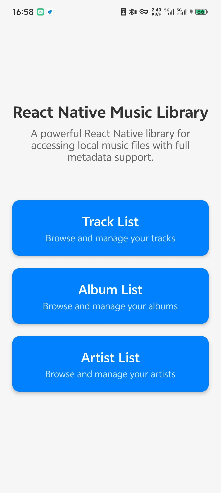
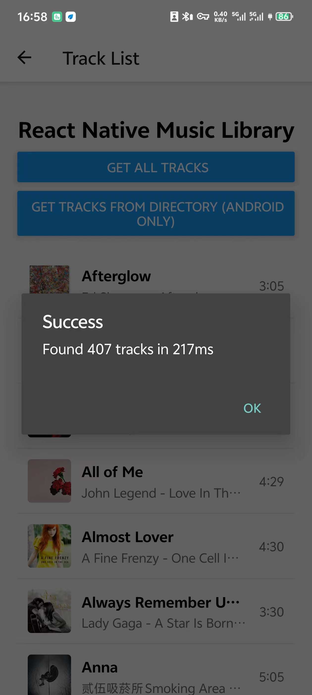
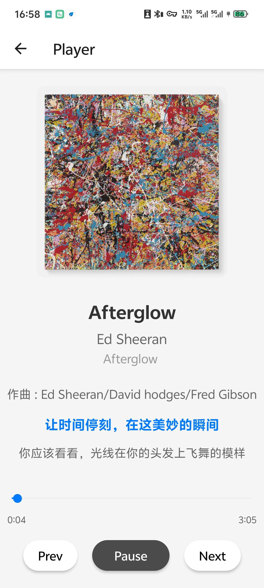
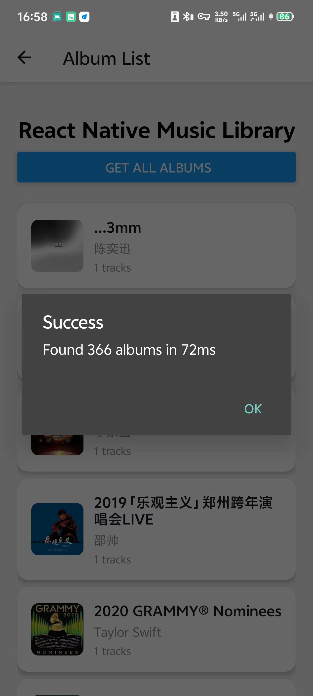
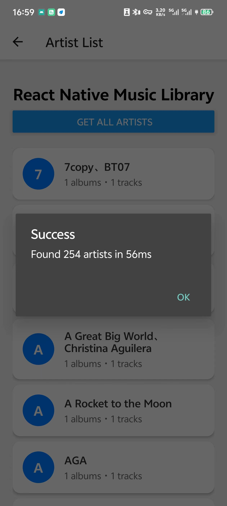

# react-native-music-library

[](https://badge.fury.io/js/@nodefinity%2Freact-native-music-library)
[](https://opensource.org/licenses/MIT)

[中文](./README_ZH.md)

[Documentation](https://nodefinity.github.io/react-native-music-library/) ·
[Getting Started](https://nodefinity.github.io/react-native-music-library/docs/getting-started) ·
[API Reference](https://nodefinity.github.io/react-native-music-library/docs/api)

A React Native local music library for Android and iOS. Query on-device tracks, albums, artists, artwork, lyrics, and audio metadata through Android MediaStore and iOS MediaPlayer. Built with TurboModules and the React Native New Architecture.

<div style="display: flex; gap: 10px; flex-wrap: wrap; justify-content: center;">
  
  
  
  
  
</div>

## ✨ Features

- 🎵 **Rich Metadata** - Access local music with full metadata including lyrics, bitrate, sample rate, and more
- 🚀 **TurboModules** - Built with React Native's New Architecture for maximum performance
- 📄 **Pagination** - Cursor-based pagination for efficiently handling large music collections
- 🔍 **Flexible Sorting** - Multiple sorting options for tracks, albums, and artists
- 📁 **Directory Filtering** - Filter tracks by specific directories (Android)
- 🔄 **TypeScript** - Full type definitions and type safety
- 🎨 **Album Artwork** - Support for album artwork and cover images
- 🤖 **Android** - Full native Android implementation
- 🍎 **iOS** - Full native iOS implementation via MediaPlayer framework

## 🚀 Quick Start

### Installation

```bash
npm install @nodefinity/react-native-music-library
# or
yarn add @nodefinity/react-native-music-library
```

### Permissions

**Android** — add to `android/app/src/main/AndroidManifest.xml`:

```xml
<uses-permission android:name="android.permission.READ_MEDIA_AUDIO" />
<uses-permission android:name="android.permission.READ_EXTERNAL_STORAGE" />
```

**iOS** — add to `Info.plist`:

```xml
<key>NSAppleMusicUsageDescription</key>
<string>This app needs access to your music library.</string>
```

### Basic Usage

```js
import {
  getTracksAsync,
  getAlbumsAsync,
  getArtistsAsync,
} from '@nodefinity/react-native-music-library';

// Get first 20 tracks sorted by title
const result = await getTracksAsync({ sortBy: ['title', true] });
console.log(result.items); // Track[]
console.log(result.hasNextPage); // boolean
console.log(result.endCursor); // string | undefined

// Get next page
const nextPage = await getTracksAsync({
  sortBy: ['title', true],
  first: 20,
  after: result.endCursor,
});
```

## 📖 API

### `getTracksAsync(options?)`

Returns a paginated list of tracks from the music library.

```ts
getTracksAsync(options?: TrackOptions): Promise<PaginatedResult<Track>>
```

**TrackOptions**

| Property    | Type                                                     | Default     | Description                                          |
| ----------- | -------------------------------------------------------- | ----------- | ---------------------------------------------------- |
| `first`     | `number`                                                 | `20`        | Items to return (`1`–`1000`)                         |
| `after`     | `string`                                                 | —           | Cursor from previous page's `endCursor`              |
| `sortBy`    | `TrackSortByKey \| [TrackSortByKey, boolean] \| (...)[]` | `'default'` | Sort key, or tuple `[key, ascending]`                |
| `directory` | `string`                                                 | —           | Legacy path or supported SAF tree URI (Android only) |

**TrackSortByKey**: `'default' \| 'title' \| 'artist' \| 'album' \| 'duration' \| 'createdAt' \| 'modifiedAt' \| 'fileSize'`

The default sort is title ascending. A bare sort key such as `sortBy: 'artist'`
means descending; use `[key, true]` for ascending. Multiple descriptors are
applied in order, with the entity ID used as a final ascending tie-breaker.

---

### `getTrackMetadataAsync(trackId)`

Returns detailed audio metadata for a single track.

```ts
getTrackMetadataAsync(trackId: string): Promise<TrackMetadata>
```

---

### `getTracksByAlbumAsync(albumId)`

Returns all tracks in an album (no pagination).

```ts
getTracksByAlbumAsync(albumId: string): Promise<Track[]>
```

---

### `getTracksByArtistAsync(artistId, options?)`

Returns a paginated list of tracks by an artist.

```ts
getTracksByArtistAsync(artistId: string, options?: TrackOptions): Promise<PaginatedResult<Track>>
```

---

### `getAlbumsAsync(options?)`

Returns a paginated list of albums.

```ts
getAlbumsAsync(options?: AlbumOptions): Promise<PaginatedResult<Album>>
```

**AlbumOptions**

| Property | Type                                                     | Default     | Description                             |
| -------- | -------------------------------------------------------- | ----------- | --------------------------------------- |
| `first`  | `number`                                                 | `20`        | Items to return (`1`–`1000`)            |
| `after`  | `string`                                                 | —           | Cursor from previous page's `endCursor` |
| `sortBy` | `AlbumSortByKey \| [AlbumSortByKey, boolean] \| (...)[]` | `'default'` | Sort key, or tuple `[key, ascending]`   |

**AlbumSortByKey**: `'default' \| 'title' \| 'artist' \| 'trackCount' \| 'year'`

---

### `getAlbumsByArtistAsync(artistId)`

Returns all albums by an artist (no pagination).

```ts
getAlbumsByArtistAsync(artistId: string): Promise<Album[]>
```

---

### `getArtistsAsync(options?)`

Returns a paginated list of artists.

```ts
getArtistsAsync(options?: ArtistOptions): Promise<PaginatedResult<Artist>>
```

**ArtistOptions**

| Property | Type                                                       | Default     | Description                             |
| -------- | ---------------------------------------------------------- | ----------- | --------------------------------------- |
| `first`  | `number`                                                   | `20`        | Items to return (`1`–`1000`)            |
| `after`  | `string`                                                   | —           | Cursor from previous page's `endCursor` |
| `sortBy` | `ArtistSortByKey \| [ArtistSortByKey, boolean] \| (...)[]` | `'default'` | Sort key, or tuple `[key, ascending]`   |

**ArtistSortByKey**: `'default' \| 'title' \| 'trackCount' \| 'albumCount'`

---

## 📦 Types

### `Track`

| Field        | Type      | Description                                                 |
| ------------ | --------- | ----------------------------------------------------------- |
| `id`         | `string`  | Unique identifier                                           |
| `title`      | `string`  | Track title                                                 |
| `artist`     | `string`  | Artist name                                                 |
| `artwork`    | `string?` | Artwork file URI (may be undefined)                         |
| `album`      | `string`  | Album name                                                  |
| `duration`   | `number`  | Duration in seconds                                         |
| `url`        | `string`  | Playable URI; preserves `file://` when available on Android |
| `contentUri` | `string?` | Canonical Android MediaStore URI                            |
| `createdAt`  | `number?` | Date added, Unix timestamp in seconds                       |
| `modifiedAt` | `number?` | Resource modification time in Unix seconds; `null` on iOS   |
| `fileSize`   | `number`  | File size in bytes                                          |

### Android Track resources

Use `contentUri` as the canonical Android Track resource. `url` remains
backward compatible: it is a `file://` URI when MediaStore exposes a legacy
path, and otherwise falls back to the same playable `content://` URI. Track
Metadata is opened through `ContentResolver`, so a Track no longer requires a
`DATA` path.

`directory` still accepts an absolute path for existing callers. On Android 10+
it also accepts a Storage Access Framework tree URI from the system external
storage provider, including mounted removable volumes; filtering uses the
MediaStore volume and relative path. Other document providers and SAF tree URIs
on older Android versions reject with `UNSUPPORTED_DIRECTORY_URI` instead of
guessing a `/storage/...` path.

### `TrackMetadata`

| Field         | Type     | Description                          |
| ------------- | -------- | ------------------------------------ |
| `id`          | `string` | Track ID                             |
| `duration`    | `number` | Duration in seconds                  |
| `bitrate`     | `number` | Bitrate in kbps                      |
| `sampleRate`  | `number` | Sample rate in Hz                    |
| `channels`    | `string` | Number of audio channels             |
| `format`      | `string` | Audio format (e.g. `"AAC"`, `"MP3"`) |
| `title`       | `string` | Title tag                            |
| `artist`      | `string` | Artist tag                           |
| `album`       | `string` | Album tag                            |
| `year`        | `number` | Release year                         |
| `genre`       | `string` | Genre tag                            |
| `track`       | `number` | Track number                         |
| `disc`        | `number` | Disc number                          |
| `composer`    | `string` | Composer tag                         |
| `lyricist`    | `string` | Lyricist tag                         |
| `lyrics`      | `string` | Embedded lyrics                      |
| `albumArtist` | `string` | Album artist tag                     |
| `comment`     | `string` | Comment tag                          |

### `Album`

| Field        | Type      | Description                    |
| ------------ | --------- | ------------------------------ |
| `id`         | `string`  | Unique identifier              |
| `title`      | `string`  | Album name                     |
| `artist`     | `string`  | Primary artist                 |
| `artwork`    | `string?` | Artwork URI (may be undefined) |
| `trackCount` | `number`  | Number of tracks               |
| `year`       | `number?` | Release year                   |

### `Artist`

| Field        | Type     | Description            |
| ------------ | -------- | ---------------------- |
| `id`         | `string` | Unique identifier      |
| `title`      | `string` | Artist name            |
| `albumCount` | `number` | Number of albums       |
| `trackCount` | `number` | Total number of tracks |

### `PaginatedResult<T>`

| Field         | Type      | Description                               |
| ------------- | --------- | ----------------------------------------- |
| `items`       | `T[]`     | Array of results                          |
| `hasNextPage` | `boolean` | Whether more items are available          |
| `endCursor`   | `string?` | Pass to `after` to fetch next page        |
| `totalCount`  | `number?` | Total count (may be expensive to compute) |

`endCursor` is the ID of the last returned entity. Reuse it only with the same
entity, filters, and sort options. A malformed cursor rejects with
`INVALID_CURSOR`; a valid ID absent from the current result rejects with
`CURSOR_NOT_FOUND`. A cursor at the final entity returns an empty terminal page
without a new `endCursor`.

---

## 🔄 Pagination Example

```ts
async function fetchAllTracks() {
  const allTracks = [];
  let cursor: string | undefined;

  do {
    const result = await getTracksAsync({ first: 50, after: cursor });
    allTracks.push(...result.items);
    cursor = result.hasNextPage ? result.endCursor : undefined;
  } while (cursor);

  return allTracks;
}
```

For workflows that need the complete current result, use
`getAllTracksAsync`, `getAllTracksByArtistAsync`, `getAllAlbumsAsync`, or
`getAllArtistsAsync`. These helpers follow `endCursor`, preserve the low-level
query options, and reject malformed or non-advancing native pagination.

## 🤝 Contributing

See [CONTRIBUTING.md](CONTRIBUTING.md) for details.

## 📄 License

MIT License - see [LICENSE](LICENSE) for details.
