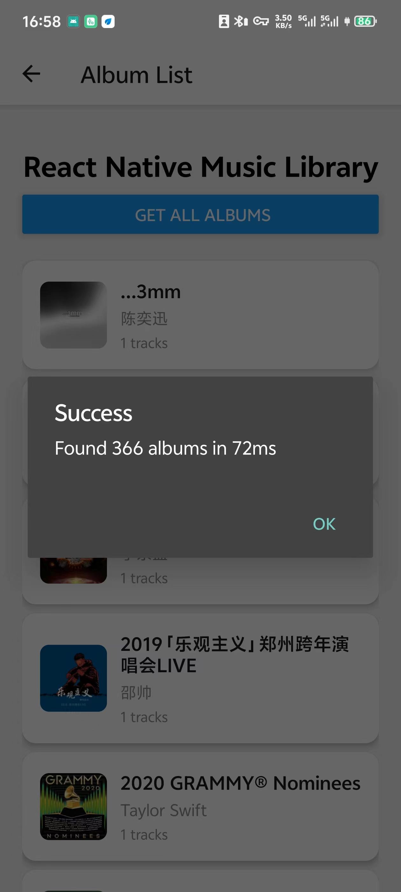
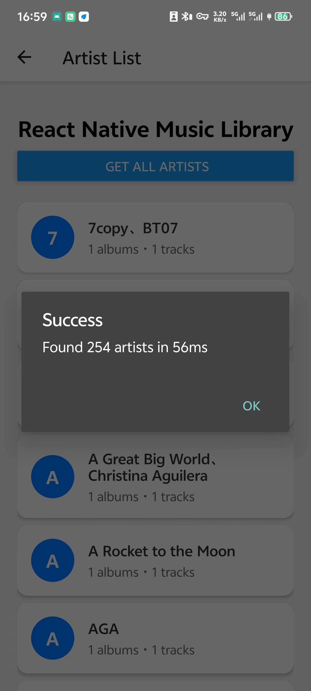

# react-native-music-library

[](https://badge.fury.io/js/@nodefinity%2Freact-native-music-library)
[](https://opensource.org/licenses/MIT)

[中文](./README_ZH.md)

A powerful React Native library for accessing local music files and getting full metadata. Built with React Native's New Architecture (TurboModules) for optimal performance.


<div style="display: flex; gap: 10px; flex-wrap: wrap; justify-content: center;">
  
  
  
  
  
</div>

## ✨ Features

- 🎵 **Rich Metadata** - Access local music with full metadata including lyrics
- 🚀 **TurboModules** - Built with React Native's New Architecture for maximum performance
- 📄 **Pagination** - Efficient handling of large music collections
- 🔍 **Flexible Sorting** - Multiple sorting options for tracks, albums, and artists
- 📁 **Directory Filtering** - Filter music by specific directories
- 🔄 **TypeScript** - Full type definitions and type safety
- 🎨 **Album Artwork** - Support for album artwork and cover images
- 🤖 **Android Support** - Full native Android implementation
- 📱 **iOS Support** - Coming soon

## 🚀 Quick Start

### Installation

```bash
npm install @nodefinity/react-native-music-library
# or
yarn add @nodefinity/react-native-music-library
```

### Basic Usage

```js
import { getTracksAsync, getAlbumsAsync, getArtistsAsync } from '@nodefinity/react-native-music-library';

// Get tracks
const tracks = await getTracksAsync();

// Get albums with sorting
const albums = await getAlbumsAsync({
  sortBy: ['title', true], // Sort by title ascending
  first: 50
});

// Get artists
const artists = await getArtistsAsync();
```

### Android Permissions

Add to `android/app/src/main/AndroidManifest.xml`:

```xml
<uses-permission android:name="android.permission.READ_MEDIA_AUDIO" />
<uses-permission android:name="android.permission.READ_EXTERNAL_STORAGE" />
```

## 🤝 Contributing

See [CONTRIBUTING.md](CONTRIBUTING.md) for details.

## 📄 License

MIT License - see [LICENSE](LICENSE) for details.
