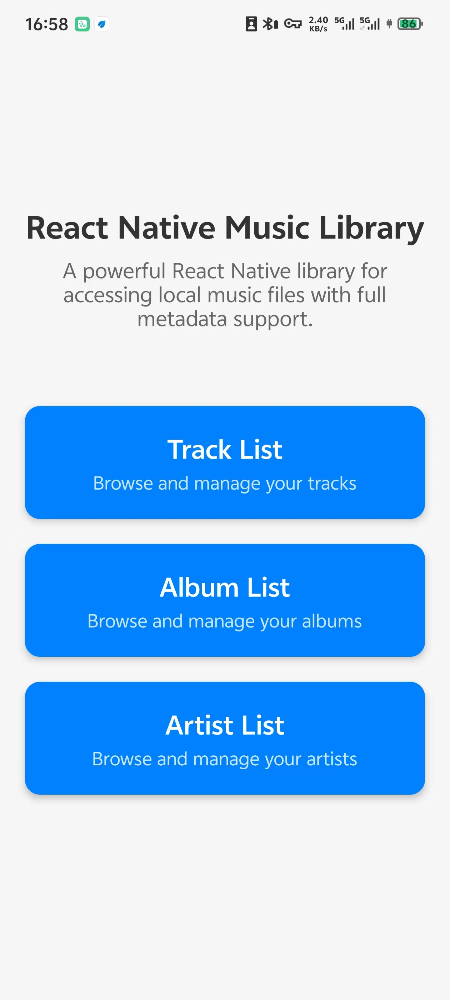
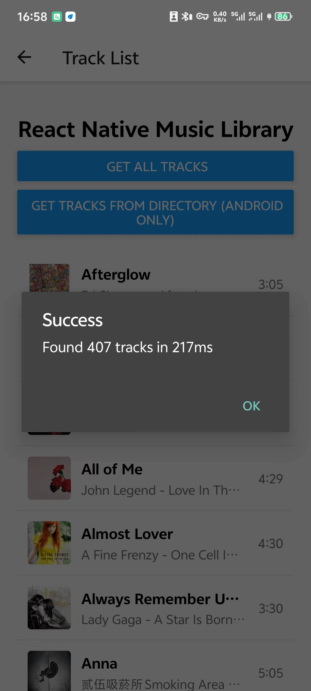
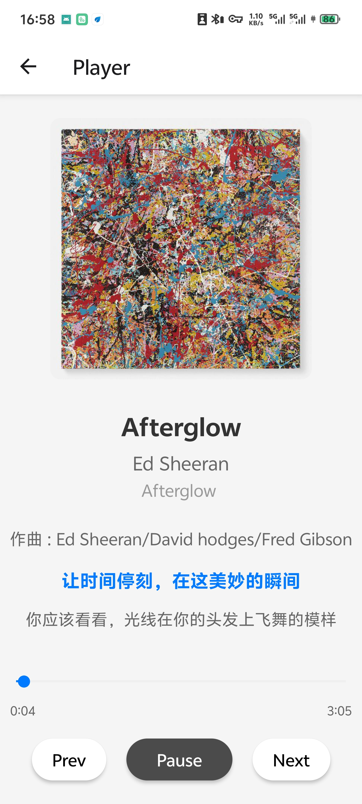
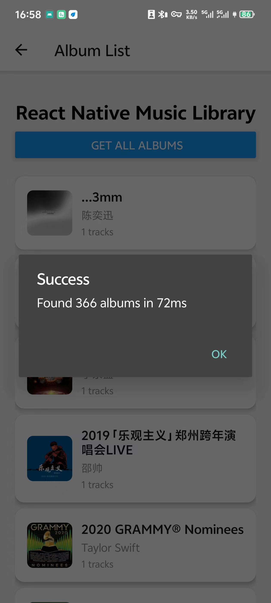
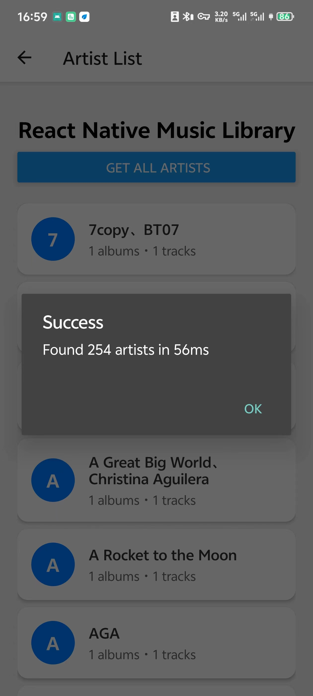

# react-native-music-library

[](https://badge.fury.io/js/@nodefinity%2Freact-native-music-library)
[](https://opensource.org/licenses/MIT)

[English](./README.md)

基于 React Native 新架构（TurboModules）构建的 React Native 库，用于访问本地音乐文件并获取完整的元数据信息。

<div style="display: flex; gap: 10px; flex-wrap: wrap; justify-content: center;">
  
  
  
  
  
</div>

## ✨ 特性

- 🎵 **丰富元数据** - 访问本地音乐并获取完整元数据，包括歌词
- 🚀 **TurboModules** - 基于 React Native 新架构构建，性能卓越
- 📄 **分页支持** - 高效处理大型音乐集合
- 🔍 **灵活排序** - 支持曲目、专辑和艺术家的多种排序选项
- 📁 **目录过滤** - 按特定目录过滤音乐
- 🔄 **TypeScript** - 完整的类型定义和类型安全
- 🎨 **专辑封面** - 支持专辑封面和图片
- 🤖 **Android 支持** - 完整的原生 Android 实现
- 📱 **iOS 支持** - 即将推出

## 🚀 快速开始

### 安装

```bash
npm install @nodefinity/react-native-music-library
# 或
yarn add @nodefinity/react-native-music-library
```

### 基本用法

```js
import { getTracksAsync, getAlbumsAsync, getArtistsAsync } from '@nodefinity/react-native-music-library';

// 获取曲目
const tracks = await getTracksAsync();

// 获取专辑并排序
const albums = await getAlbumsAsync({
  sortBy: ['title', true], // 按标题升序排序
  first: 50
});

// 获取艺术家
const artists = await getArtistsAsync();
```

### Android 权限

在 `android/app/src/main/AndroidManifest.xml` 中添加：

```xml
<uses-permission android:name="android.permission.READ_MEDIA_AUDIO" />
<uses-permission android:name="android.permission.READ_EXTERNAL_STORAGE" />
```

## 🤝 贡献

详情请参阅 [CONTRIBUTING.md](CONTRIBUTING.md)。

## 📄 许可证

MIT 许可证 - 详情请参阅 [LICENSE](LICENSE)。
